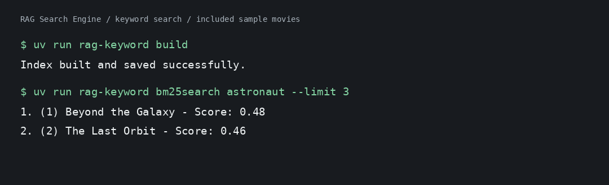

# RAG Search Engine

A Python CLI movie search engine combining keyword, semantic, and image-based retrieval, with optional LLM reranking and answer generation.



*Actual CLI output from the included fictional movie dataset.*

## Motivation

Finding a movie usually starts with a half-remembered scene, not a title. Keyword search matches exact terms; semantic search connects descriptions that use different words. This project combines both so you can compare how retrieval, ranking, and generation change the answers you get.

## Quick Start

Requires **Python 3.13+** and [uv](https://docs.astral.sh/uv/). The bundled sample data runs without an API key or model download.

```sh
git clone https://github.com/amayakmt/rag-search-engine.git
cd rag-search-engine
uv sync --frozen

export RAG_DATA_DIR="$PWD/examples"
export RAG_CACHE_DIR="$PWD/cache/demo"
uv run rag-keyword build
uv run rag-keyword bm25search "astronaut" --limit 3
```

Expected output:

```text
1. (1) Beyond the Galaxy - Score: 0.48
2. (2) The Last Orbit - Score: 0.46
```

Keep the same environment variables for the examples below.

## Usage

Every command supports `--help`.

### Search

```sh
uv run rag-keyword bm25search "astronaut"
uv run rag-semantic search "surviving a disaster in space"
uv run rag-semantic search_chunked "discovering a lost civilization"
uv run rag-hybrid weighted-search "space adventure" --alpha 0.5
uv run rag-hybrid rrf-search "space adventure" -k 60
```

Semantic and image search download their models on first use. Hybrid search builds or refreshes the keyword index automatically; standalone keyword search needs `rag-keyword build` first.

### Enhance, Rerank, Evaluate

```sh
uv run rag-hybrid rrf-search "astronuat" --enhance spell
uv run rag-hybrid rrf-search "space adventure" --rerank-method cross_encoder
uv run rag-hybrid rrf-search "space adventure" --rerank-method batch --evaluate --debug
```

| Option | Purpose |
| --- | --- |
| `--limit N` | Max results (default 5). |
| `--alpha FLOAT` | Keyword weight for weighted search, 0 to 1 (default 0.5). |
| `-k INT` | RRF constant (default 60). |
| `--enhance spell\|rewrite\|expand` | LLM query enhancement. |
| `--rerank-method individual\|batch\|cross_encoder` | Rerank with an LLM or a local cross-encoder. |
| `--evaluate` | LLM relevance score (0–3) per result. |
| `--debug` | Log RRF pipeline stages. |

Enhancement, LLM reranking, and `--evaluate` need `OPENROUTER_API_KEY` in your environment or `.env`. Cross-encoder reranking needs no key. Never commit credentials.

### Generate Answers

```sh
uv run rag-generate rag "Which movies involve astronauts?"
uv run rag-generate summarize "space travel" --limit 5
uv run rag-generate citations "Which movie features a damaged space station?"
uv run rag-generate question "What does the astronaut discover in Beyond the Galaxy?"
```

Requires the API key. Answers depend on both retrieved context and the model; citations don't guarantee accuracy.

### Search with Images

```sh
uv run rag-multimodal image_search path/to/image.jpg
uv run rag-describe-image --image path/to/image.jpg --query "Find movies with a similar scene"
```

`image_search` compares an image to movie descriptions using CLIP embeddings. `rag-describe-image` uses an image-capable LLM to build a search query and requires the API key.

<details>
<summary>Inspection and evaluation commands</summary>

```sh
uv run rag-keyword tf 1 "astronaut"
uv run rag-keyword idf "astronaut"
uv run rag-keyword tfidf 1 "astronaut"
uv run rag-keyword bm25idf "astronaut"
uv run rag-keyword bm25tf 1 "astronaut"
uv run rag-semantic chunk "An astronaut follows a signal into deep space." --chunk-size 5 --overlap 1
uv run rag-semantic semantic_chunk "A signal arrives. An astronaut follows it." --max-chunk-size 2 --overlap 1
uv run rag-multimodal verify_image_embedding path/to/image.jpg
uv run rag-evaluate --limit 5
```

`rag-evaluate` reports precision, recall, and F1 against a `golden_dataset.json` in your data directory. The sample set has no labels, so add your own. No API key needed.

</details>

## Use Your Own Data

Put these in your data directory:

| File | Format |
| --- | --- |
| `movies.json` | `{"movies": [{"id": 1, "title": "Example", "description": "..."}]}` (unique integer IDs) |
| `stopwords.txt` | One stopword per line. |
| `golden_dataset.json` | Optional, for evaluation: `{"test_cases": [{"query": "example", "relevant_docs": ["Example"]}]}` (relevant movies identified by title) |

To switch from the sample data to the default `data/` directory:

```sh
unset RAG_DATA_DIR RAG_CACHE_DIR
uv run rag-keyword build
```

Or point `RAG_DATA_DIR` and `RAG_CACHE_DIR` at your own directories. Relative paths resolve from the project location, not the launch directory. Non-editable installs should use external data and writable cache paths.

Local data, caches, and `.env` are git-ignored. Embedding caches are fingerprinted by model and corpus, so changed data rebuilds automatically. Only use trusted keyword caches: indexes use Python pickle.

## Contributing

Fork, clone, and follow the Quick Start. `uv sync` installs in editable mode.

```sh
uv run --frozen python -m unittest discover -s tests -v
uv build
```

Tests use temporary caches and mock all model and LLM calls, so they need no downloads or credentials. CI runs on Python 3.13. Live retrieval quality and provider behavior need separate integration testing.

```text
rag_search_engine/   # Core retrieval, ranking, LLM services, utilities
cli/                 # Argument parsing and terminal output
examples/            # Sample data and demo image
tests/               # Offline regression tests
```

Keep reusable logic in `rag_search_engine` and presentation in `cli`. Open pull requests with focused changes and regression tests for behavior changes. For bugs, include the command, expected vs. actual output, and no credentials.
